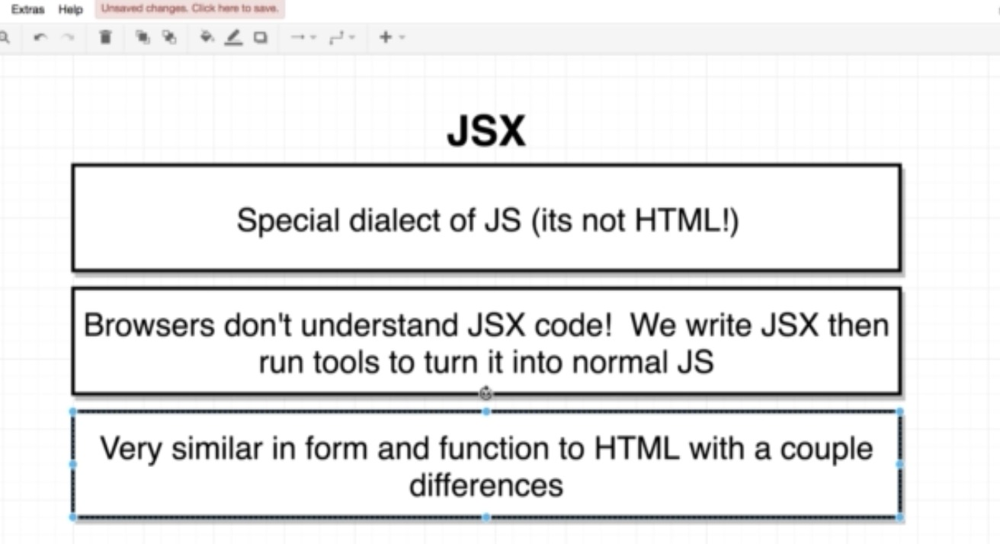

#### Three steps for component creation
* import React & ReactDOM libraries
* create component
* show on screen or export

#### For automatic refresh
* For automatic refresh to reflect changes, insert following into index.js
 ```
 if(modules.hot) {
     module.hot.accept();
 }
 ```

#### Difference JSX and HTML
* 
* Further, Babal library is used to take in JSX and convert it into JS
* [online editor](https://codepen.io/) -> start Coding
* Three difference between HTML & JSX writing
  * Style = {{'':''}} -> json object
  * class name is not referred as class, it is className
  * JS variables or function are refered on enclosing it within {}

#### JSX
* Javascript object cannot use JS object. It can deal with variable any value other than JS obj.
   However, we can field value in that object via ```{objectButton.text}```


   